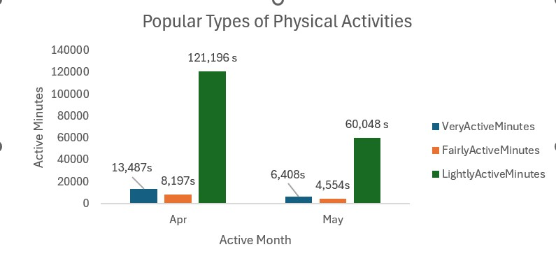
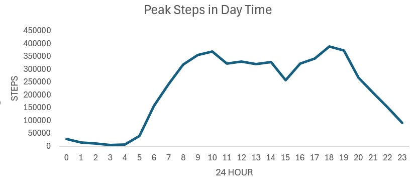
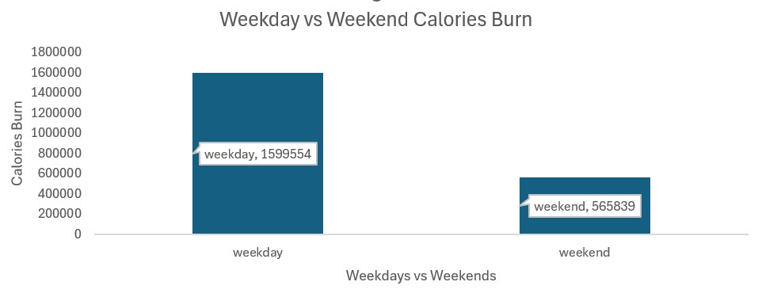
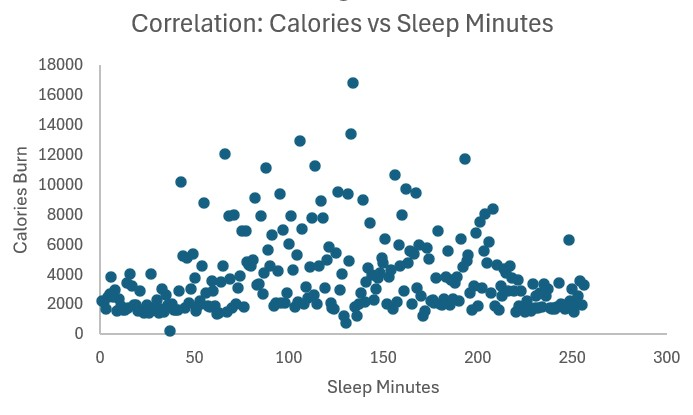
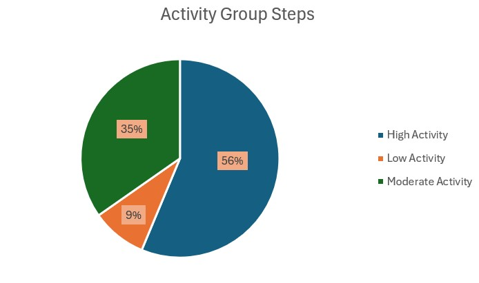
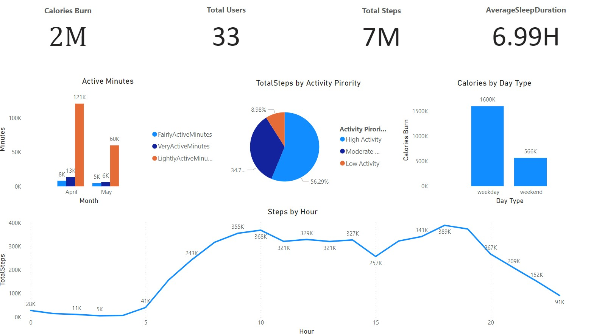

# 🌿 Bellabeat Smart Device Case Study

This case study is part of the Google Data Analytics Capstone. It analyzes user data from Bellabeat’s smart wellness devices to uncover trends in physical activity, sleep patterns, and other lifestyle behaviors. The goal is to provide actionable recommendations to optimize product features and marketing strategies.

**Tools:** SQL, Excel, Tableau, Power BI  
**Skills:** Data cleaning, behavioral analysis, segmentation, dashboard visualization, storytelling

---

## Table of Contents
- [Ask](#ask)
- [Prepare](#prepare)
- [Clean and Process](#clean-and-process)
- [Analyze](#analyze)
- [Act](#act)
- [Share (Power BI Visuals)](#share-power-bi-visuals)

---

## Ask

### Project Overview
This case study was completed as part of the Google Data Analytics Certificate. The project focuses on Bellabeat — a health-focused smart device company — and how user behavior data can inform business growth.

### Business Context
Bellabeat creates wellness trackers aimed at women. With competition rising, they seek to better understand how users interact with their products to boost engagement, retention, and customer value.

### Key Questions
- What activities are users engaging in most?
- How do weekday vs weekend patterns differ?
- Are sleep, calorie burn, or heart rate linked to activity?
- Which user segments are most engaged?

---

## Prepare

- Source: Fitbit dataset from 30 women over 31 days
- Tables used: Daily activity, sleep, heart rate, steps, and calories
- Tools: R, Excel for wrangling; Power BI and Tableau for visualization

---

## Clean and Process

- Merged all tables using user ID and date
- Removed duplicates and handled null/missing data
- Filtered out unrealistic records (e.g., steps = 0 with high calorie burn)
- Parsed datetime formats
- Created calculated fields (e.g., total active minutes, average sleep time)

---

## Analyze

**Key behavior trends examined:**
- Step count vs. calories burned
- Daily sleep duration and consistency
- Active minutes segmented by weekday vs. weekend
- Heart rate zone intensity

**Notable findings:**
- Majority of users did not reach 30 minutes of daily activity
- Weekend routines are inconsistent, often lower in activity
- Users with consistent sleep showed higher energy and movement during the day

---

## Act

**Recommendations:**
1. **Gamify Activity Goals:** Push users toward the 30 min/day benchmark with smart nudges and rewards
2. **Sleep Optimization Features:** Implement smart sleep tips, bedtime reminders, and recovery insights
3. **Segmented Marketing Campaigns:** Differentiate messaging based on activity and sleep usage patterns
4. **Community Challenges:** Encourage consistency through group fitness goals or leaderboard challenges

---

## Share (Power BI Visuals)

Below are key dashboards created using Power BI. These visuals highlight:
- Weekly trends in calories burned
- Step count distribution across days
- Activity classification by intensity level
- Sleep vs. activity comparison plots
- Engagement breakdowns by user clusters

1. Activity Patterns
Finding: The most popular activities among users are lightly active minutes and sedentary minutes. High-intensity activities (very active minutes) occur less frequently.

Visualization: 

Activity levels tend to peak during morning (7–9 AM) and evening hours (5–7 PM).

Visualization: 

2. Weekday vs. Weekend Behavior
Finding: Users are generally more active on weekends, with more steps taken and higher active minutes compared to weekdays. However, calorie burn is similar across both.
 

4. Correlation Between Sleep and Activity
Finding: While longer sleep duration does not strongly correlate with higher activity levels, users with better sleep quality tend to engage in more physical activity.
Visualization: 

5. Segmentation by Activity Level
Finding: Users can be segmented into low, moderate, and high activity groups based on daily steps, with high activity users demonstrating more consistent engagement and better wellness scores.
Visualization: 

The Power Bi Dashboard As Below:

Key Insights and Recommendations
Encourage High-Intensity Activities: Promote short, intense workout routines to increase calorie burn and engagement.
Weekday Challenges: Introduce weekday-specific challenges to maintain activity levels during workdays.
Improve Sleep Quality: Focus on enhancing sleep quality through in-app sleep hygiene tips and reminders.
Personalized Engagement: Segment users based on their activity levels and provide tailored challenges, rewards, and fitness goals.
